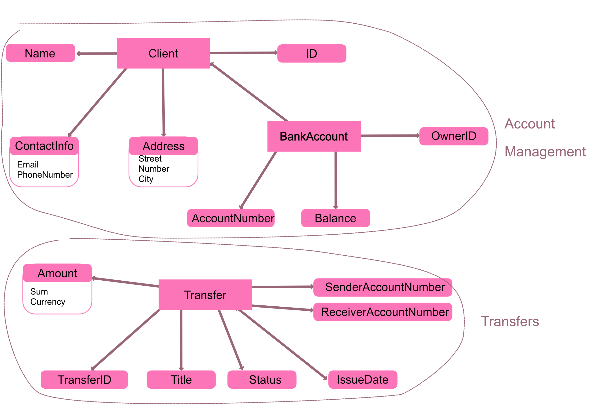

## Zadanie 1 - Domain Driven Design

Zaprojektowany przeze mnie model skupia się na wybranych kontekstach związanych z zarządzaniem kontem bankowym i realizacją przelewów.
W kontekście zarządzanie kontem (tutaj _Account Management_) zdefiniowałam agregat _BankAccount_ powiązany z encją _Client_ przez jego unikalne ID (_OwnerID_). 
W kontekście operacji przelewów (tutaj _Transfers_) jest to agregat _Transfer_, powiązany z poprzednim kontekstem i agregatem _BankAccount_ przez obiekty wartości _SenderAccountID_ i _ReceiverAccountID_. 

### Kontekst: 'Account Management', Agregat: 'BankAccount' 

Reprezentuje konto klienta w banku.

**Aggregate Root**: BankAccount

| Element       | Typ             | Format danych | Atrybuty                                  | 
|---------------|-----------------|---------------|-------------------------------------------|
| ID            | Obiekt Wartości | UUID          | -                                         | 
| Name          | Obiekt Wartości | String        | -                                         | 
| Address       | Obiekt Wartości | -             | String Street, String Number, String City |
| ContactInfo   | Obiekt Wartości | -             | String Email, String PhoneNumber          |
| Client        | **Encja**       | -             | ID, Name, ContactInfo, Address            |
| AccountNumber | Obiekt Wartości | Long          | -                                         |
| Balance       | Obiekt Wartości | Float         | -                                         |
| OwnerID       | Obiekt Wartości | UUID          | -                                         | 
| BankAccount   | **Encja**       | -             | AccountNumber, Balance, OwnerID           | 

### Kontektst: 'Transfers', Agregat: 'Transfer'

Reprezentuje operację przelewu w systemie. 

**Aggregate Root**: Transfer

| Element               | Typ             | Format danych                 | Atrybuty                                                                                 | 
|-----------------------|-----------------|-------------------------------|------------------------------------------------------------------------------------------|
| TransferID            | Obiekt Wartości | UUID                          | -                                                                                        | 
| SenderAccountNumber   | Obiekt Wartości | UUID                          | -                                                                                        | 
| ReceiverAccountNumber | Obiekt Wartości | UUID                          | -                                                                                        | 
| Amount                | Obiekt Wartości | -                             | Float Sum, Enum(PLN, EUR, ...) Currency                                                  | 
| Title                 | Obiekt Wartości | String                        | -                                                                                        |
| Status                | Obiekt Wartości | Enum(Pending, Finalised, ...) | -                                                                                        |
| IssueDate             | Obiekt Wartości | Date                          | -                                                                                        | 
| Transfer              | **Encja**       | -                             | TransferID, SenderAccountNumber, ReceiverAccountNumber, Amount, Title, Status, IssueDate |

### Model 

